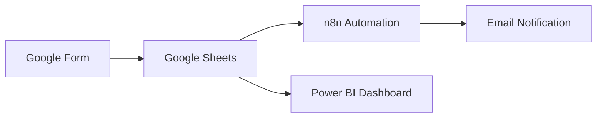
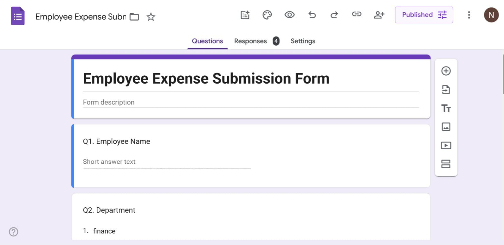
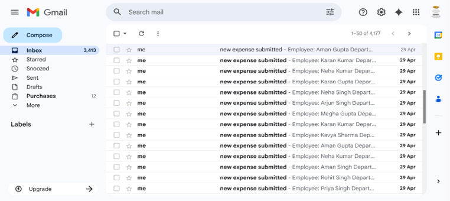

# 💰 Smart Expense Tracker using n8n, Google Forms & Power BI

An AI-powered Expense Automation System built using **Google Forms, Google Sheets, n8n, Gmail Automation, and Power BI** for real-time financial tracking, automated workflows, and data-driven decision-making.

---

## 📌 Project Overview

This project automates the complete expense tracking process — from collecting expense data through Google Forms to sending automated notifications and visualizing insights in Power BI.

The workflow helps users:

* Track daily expenses efficiently
* Automate data collection
* Receive instant email notifications
* Analyze spending patterns using dashboards
* Reduce manual work through automation

---

# 🚀 Features

✅ Expense Entry through Google Forms
✅ Automated Workflow using n8n
✅ Real-Time Data Storage in Google Sheets
✅ Email Notifications for New Entries
✅ Interactive Power BI Dashboard
✅ Expense Category Analysis
✅ Monthly Spending Insights
✅ Fully Automated Expense Management System

---

# 🛠️ Tech Stack

| Technology    | Purpose                   |
| ------------- | ------------------------- |
| Google Forms  | Expense Data Collection   |
| Google Sheets | Data Storage              |
| n8n           | Workflow Automation       |
| Gmail         | Email Notifications       |
| Power BI      | Dashboard & Visualization |
| GitHub        | Project Hosting           |

---

# 📂 Project Structure

```bash
smart-expense-tracker-n8n-powerbi/
│
├── README.md
├── LICENSE
├── google_form.png
├── n8n Screenshot.png
├── Excel Screenshot.png
├── Expense data tracker.jpeg
├── email_notification.png
└── powerbi_dashboard.png
```

---

# 🔄 Workflow Architecture



---

# 📸 Project Screenshots

## 1️⃣ Google Form for Expense Entry



---

## 2️⃣ n8n Workflow Automation


---

## 3️⃣ Expense Data Tracker


---

## 4️⃣ Excel / Google Sheets Database


---

## 5️⃣ Email Notification System



---

## 6️⃣ Power BI Dashboard


---

# 📊 Power BI Dashboard Insights

The dashboard provides:

* Monthly Expense Overview
* Expense Category Distribution
* Payment Mode Analysis
* Spending Trends
* Total Expense Tracking
* Automated Financial Reporting

---

# ⚙️ How It Works

### Step 1: User submits expense details through Google Form

### Step 2: Data gets stored automatically in Google Sheets

### Step 3: n8n workflow monitors new entries

### Step 4: Automated email notification is triggered

### Step 5: Power BI dashboard updates for real-time analytics

---

# 🧠 Use Cases

* Personal Expense Management
* Business Expense Tracking
* Finance Automation Projects
* Workflow Automation Learning
* Power BI Portfolio Projects
* Data Analytics Demonstrations

---

# 📈 Future Enhancements

* AI-based Expense Prediction
* WhatsApp Notifications
* Mobile App Integration
* OCR Bill Scanner
* Budget Alert System
* Cloud Database Integration

---

# 🏆 Project Highlights

✔ End-to-End Automation
✔ Real-Time Reporting
✔ Beginner-Friendly Workflow
✔ Scalable Architecture
✔ Industry-Relevant Tech Stack

---

# 👨‍💻 Author

**Akhil Chopra**

📧 Email: [your-email@example.com](mailto:your-email@example.com)
🔗 LinkedIn: [https://linkedin.com/in/your-profile](https://linkedin.com/in/your-profile)
💻 GitHub: [https://github.com/akhil03chopra-alt](https://github.com/akhil03chopra-alt)

---

# 📜 License

This project is licensed under the MIT License.

---

# ⭐ Support

If you found this project useful, consider giving it a ⭐ on GitHub.
